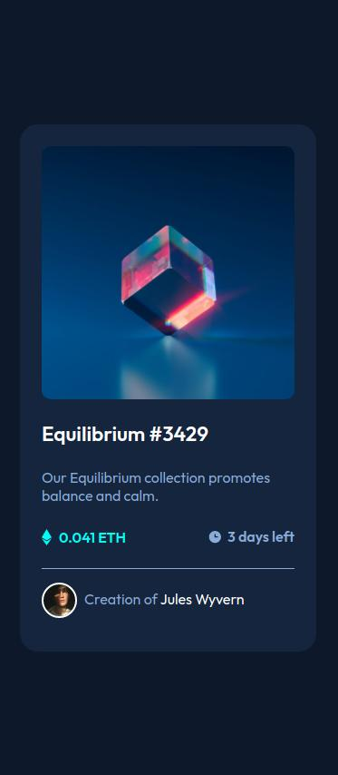
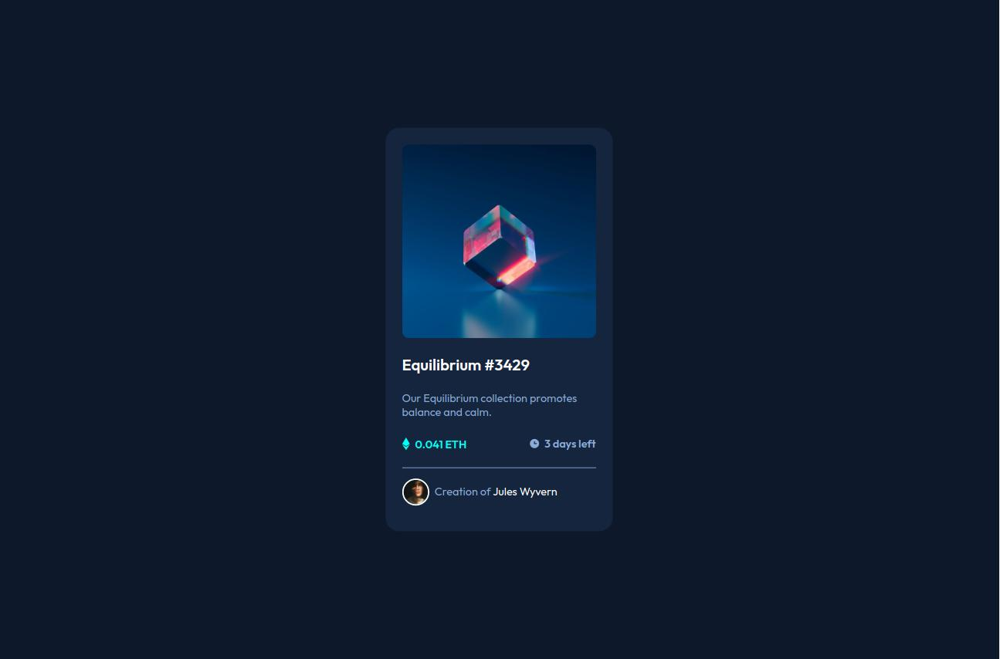

# Frontend Mentor - NFT preview card component solution

This is a solution to the [NFT preview card challenge on Frontend Mentor](https://www.frontendmentor.io/challenges/nft-preview-card-component-SbdUL_w0U). Frontend Mentor challenges help you improve your coding skills by building realistic projects. 

## Table of contents

- [Overview](#overview)
  - [Screenshot](#screenshot)
  - [Links](#links)
- [My process](#my-process)
  - [Built with](#built-with)
  - [Continued development](#continued-development)
  - [Useful resources](#useful-resources)
- [Author](#author)
- [Acknowledgments](#acknowledgments)

## Overview

### Screenshot

### Links

- Solution URL: [Github](https://github.com/BalazsBanfi/FEM-05-NFT-preview-card)
- Live Site URL: [Github page](https://balazsbanfi.github.io/FEM-05-NFT-preview-card/)

## My process

### Built with

- Semantic HTML5 markup
- CSS custom properties
- Flexbox
- Mobile-first workflow
- Media-query

### Continued development

I would like to be comfortable with responsive web design techniques and want to perfect mobil first method.

### Useful resources

- [Homepage of Kevin Powell](https://www.kevinpowell.co/) - Kevin Powell helped me in responsive techniques. I really liked his teaching methods and will use it going forward.

## Author

- Website - [Bánfi Balázs](https://github.com/BalazsBanfi)
- Frontend Mentor - [@bally4h](https://www.frontendmentor.io/profile/bally4h)
- Twitter - [@yourusername](https://www.twitter.com/yourusername)

## Acknowledgments

Thanks for the helps to Frontend Mentor, The Odin Project, freecodecamp.org, Kevin Powell, Web Dev Simplified and many others..